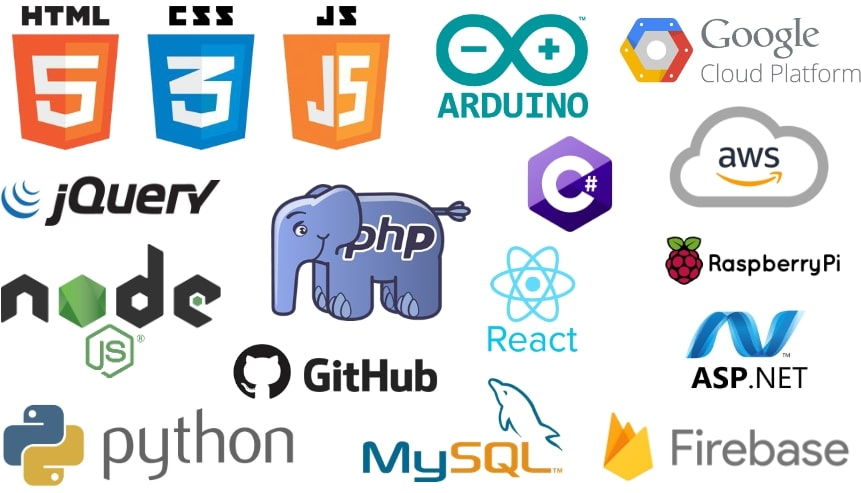

# Workshops in Web Development 1
Course Code: HTTP 5114

Academic Year: 2025-2026

This course will allow students to access additional support for content delivered in the other classes each semester. Every student in the class will engage in a process of self-assessment to help them identify areas where they would benefit from help, and then the student and teaching team will set up a process for providing support for any areas where the student would benefit from some in-the-moment support. Mentors, tutors and workshops will be available.

# links
https://www.codecademy.com/catalog/subject/web-development

# Images
.
> **Information**: This course encourages active learning and peer support, so take advantage of all available resources and seek help when needed!
